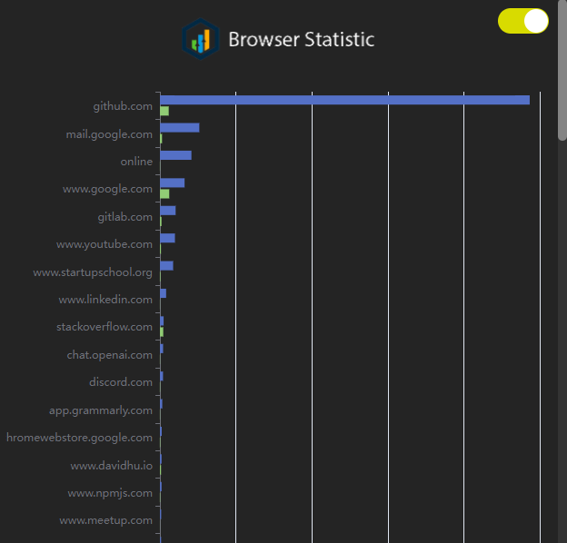

# browser-statistic
> Show what site your often browse

This is a small extension that presents statistical charts indicating the websites you frequently visit.

## ⚜️ License

browser-statistic is distributed under the terms of the MIT license.

See [LICENSE](./LICENSE) for details.
